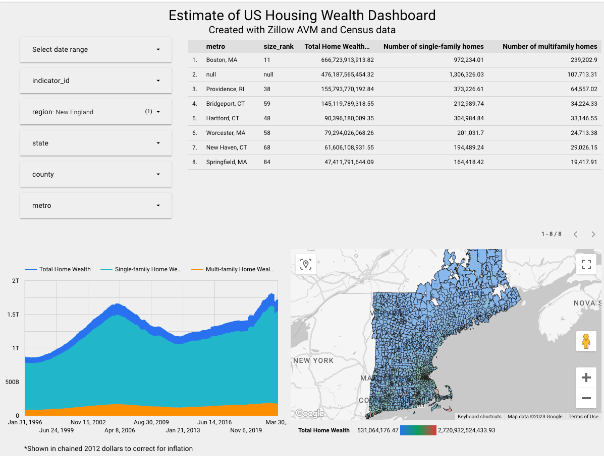

\# DTC DE Final Porject - Housing Wealth Pipeline 
Pipeline to estimate aggregate US housing wealth from Zillow Automatic Valuation Model data (AVM) and Census data

## Problem Statement

While estimated home values are readily available from many Public and Private groups, aggregate housing wealth (i.e. the sum of owner occupied home values) is not. This is largely due to most use cases being academic and a lack of completeness in most publicly available data. 

The measurement of housing wealth in the academic research has traditionally relied on two sources: homeowners’ self-reported values in surveys and extrapolations based on repeat-sales house price indexes. Both of these approaches have strengths and weaknesses. Household surveys are typically nationally representative and can capture quality changes known by the homeowner; however, research has found that homeowners’ self-reported values are often biased upward. Repeat-sales indexes are not subject to these behavioral biases but do not reflect the value of home improvements and the higher quality of new houses.

In this project a new method is implemented which makes use of local property value estimates that are derived from Zillow’s machine learning algorithms (e.g. Zestimates) and applied to detailed data on property sales and characteristics sourced from the American Community Survey. This process generates estimates that could be valuable to researchers and policymakers interested in the dynamics of housing wealth and the role that it plays in economic outcomes.

## Data 

Historical housing value estimates are sourced from Zillow – While only two series are needed for this calculation the functions in `api_to_file_etl.py` can be used for any of the available series below.

These estimates are available for a number of regions and layers including state, metro, county, and zip code levels.

Below are the top 10 most useful series:
| None | indicator_id | indicator                                                                          | category            |
|------|--------------|------------------------------------------------------------------------------------|---------------------|
| 0    | ZSFH         | ZHVI Single-Family Homes Time Series ($)                                           | Home values         |
| 1    | ZCON         | ZHVI Condo/Co-op Time Series ($)                                                   | Home values         |
| 10   | SSSW         | Median Sale Price (Smooth, SFR only, Weekly View)                                  | Inventory and sales |
| 12   | SSAW         | Median Sale Price (Smooth, All Homes, Weekly View)                                 | Inventory and sales |
| 18   | SASW         | Median Sale Price (Smooth & Seasonally Adjusted, SFR only,   Weekly View)          | Inventory and sales |
| 20   | SAAW         | Median Sale Price (Smooth & Seasonally Adjusted, All   Homes, Weekly View)         | Inventory and sales |
| 22   | RSSA         | ZORI (Smoothed, Seasonally Adjusted): All Homes Plus   Multifamily Time Series ($) | Rentals             |
| 23   | RSNA         | ZORI (Smoothed): All Homes Plus Multifamily Time Series ($)                        | Rentals             |
| 24   | NSAW         | Median Days to Pending (Smooth, All Homes, Weekly View)                            | Inventory and sales |
| 28   | MSAW         | Mean Days to Pending (Smooth, All Homes, Weekly View)                              | Inventory and sales |


For this project, I’m using the most granular zip-code level data, since it can aggregated to the other region levels using the mapping generated by `extract_api_zip_structure`

Estimates of owner-occupied housing counts (i.e., single family homes, townhouses, and condos owned by individuals for personal use) are sourced from the American Community Survey which a Census survey solely focused on gathering information on US housing. This data is sourced from the Rest API provided directly by the Census Bureau.

Several other files are necessary to correctly map the geographical fields together – these are sourced from several other API and URLs.

To compute aggregate wealth, the US housing market is divided into segments by zip-code. The average value from Zillow’s AVM for each segment is multiplied by the number of own-use housing units derived from the nationally representative ACS.

```math
 \hat{V} (p,c,t) = NACS(p,c,t)\bar{V} Z(p,c,t) 
```

where $N^{ACS}(p, c, t)$ is an estimate of the number of properties intended for own use from the ACS
and $\bar{V}(p, c, t)$ is the average AVM value for residential properties.

To compute the counts of properties intended for own use from the ACS in each county,
all housing units reported in the survey are split into three mutually exclusive and exhaustive categories:
units that are unambiguously for own use (owner-occupied plus vacant-for-sale), units that are
unambiguously for rental use (renter-occupied plus vacant-for-rent), and units that are vacant but
are not for sale or for rent.  The total number of properties intended for own use as the sum of units intended for own use plus a share
$(φ)$ of vacant properties that are not for sale or rent:

```math
N^{ACS}(p, c, t) = N^{ACS}(p, c, t | own use) + N^{ACS}(p, c, t | vacant)φ(p, c, t)
```

The share of vacant properties that are intended for personal use, $φ$, is the same as the share of occupied properties for own use so that:

```math
φ(p, c, t) = \frac{N^{ACS}(p, c, t | own use)}{N^{ACS}(p, c, t | own use) + N^{ACS}(p, c, t | rental use)}
```

## Data Pipeline


## Terraform 

Terraform is an open-source infrastructure as code (IaC) tool used to build, manage and version infrastructure resources across multiple cloud providers, including AWS, Azure, and Google Cloud Platform. It allows you to define your infrastructure in code, and then provision and manage it using simple and repeatable workflows. With Terraform, you can automate the deployment and scaling of infrastructure resources, ensuring consistency and reducing the risk of errors.

## Prefect

Prefect is a Python-based open-source workflow automation tool used to build, schedule, and monitor data workflows. It provides a flexible and scalable platform for creating workflows that can run on your local machine or in the cloud. With Prefect, you can define your workflows as code, and then execute them on any infrastructure, making it easy to scale and integrate with your existing systems.

Airflow is also an open-source workflow automation tool, but it focuses on data processing and has a strong emphasis on scheduling and task dependencies. It allows you to define workflows using Python code, and then schedule and monitor their execution using a web-based interface. Airflow has a large community and many plugins available, making it a popular choice for data engineering and data science teams.

The main difference between Prefect and Airflow is their approach to workflow execution. Prefect is designed to be more flexible and can run workflows on any infrastructure, while Airflow has a strong focus on scheduling and task dependencies. Additionally, Prefect has a modern architecture that allows for easier customization and debugging, while Airflow has a more established ecosystem and is known for its stability and reliability. Ultimately, the choice between Prefect and Airflow will depend on your specific use case and requirements.

## Data Cloud Storage and Warehouse

Google Cloud Storage (GCS) is a cloud-based storage service provided by Google Cloud that allows users to store and manage their data objects at scale. GCS is highly available and offers low latency access to data from anywhere in the world. With different storage classes such as Standard, Nearline, and Coldline, GCS provides users with options to manage the cost of storing their data while ensuring high durability.

BigQuery is a fully-managed, cloud-native data warehouse solution provided by Google Cloud that allows users to analyze large datasets using SQL-like queries. It offers high scalability and can handle petabytes of data, making it suitable for businesses of all sizes. BigQuery also provides advanced features such as machine learning integration, real-time streaming, and data encryption to ensure users can efficiently derive insights from their data. Additionally, BigQuery integrates seamlessly with other Google Cloud services, including GCS, allowing users to process and analyze data at scale from one platform.

## DBT

dbt (data build tool) is an open-source data transformation and modeling tool that enables data teams to create a scalable and maintainable data pipeline. With dbt, users can transform and model their data using SQL-based code that can be version controlled and tested like traditional software code.
## Looker

Google Looker is a cloud-based business intelligence and analytics platform that helps businesses make data-driven decisions by providing a comprehensive view of their data. Looker allows users to create and share interactive dashboards, reports, and visualizations using a simple, web-based interface.

 [**Link to the dashboard:**](https://lookerstudio.google.com/reporting/1f5246de-10f4-409b-9dea-b6f6e062d034/page/hT9ND)




## Project setup

Make sure you have the GCC SDK installed: [Google Cloud SDK/CLI](https://cloud.google.com/sdk/docs/install)

### Running Local vs Server

This project could either be setup locally or on a compute engine like [Google Cloud Compute Engine](https://cloud.google.com/compute)

### Requirements 
*  [Terraform](https://www.terraform.io/)
*  [Prefect](https://www.prefect.io/)
*  [DBT Cloud](https://www.getdbt.com/)

### Installing Dependencies

To install the dependencies, run the following code:

`pip install -r requirements.txt`

### API Keys

You will need to source keys from the below APIs to run the pipeline:
* [NASDAQ API](https://data.nasdaq.com/sign-up)
* [US Housing and Urban Development API](https://www.huduser.gov/hudapi/public/register?comingfrom=1)
* [US Census API](https://www.census.gov/data/developers/about/terms-of-service.html)
* [FRED Econ Data API](https://fred.stlouisfed.org/docs/api/api_key.html)

These keys should be stored in the `configuration.conf` file

### Setup Terraform

Run these 3 lines of code to start Terraform: 

`terraform init`

`terraform plan`

`terraform apply`

If you ever need to dismantle the infrastructure, run the below code:

`terraform destroy`

### Setup Prefect

Prefect flows can be setup with the below code

`cd ~/Housing-Wealth-Pipeline`

`prefect deployment build prefect/<Prefect File> -n avm -o prefect/<Prefect File>.yaml`

`prefect deployment apply prefect/<Prefect File>.yaml`

`prefect agent start -p 'default-agent-pool'`

### Setup DBT
* Create BigQuery credential.json file (note, make sure GCC server location aligns with the json file)
* Create new DBT cloud project from repo
* Create new branch
* run `dbt build`

### Connect to Looker

* Use the BigQuery connector to connect to the data warehouse
* It's recommended that you create a field to provide Geo data in a format Looker expects
  * i.e. for zip-code create a new field with the following formula `CONCAT(zip_code, ", ", "United States")`